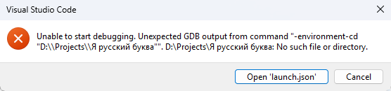
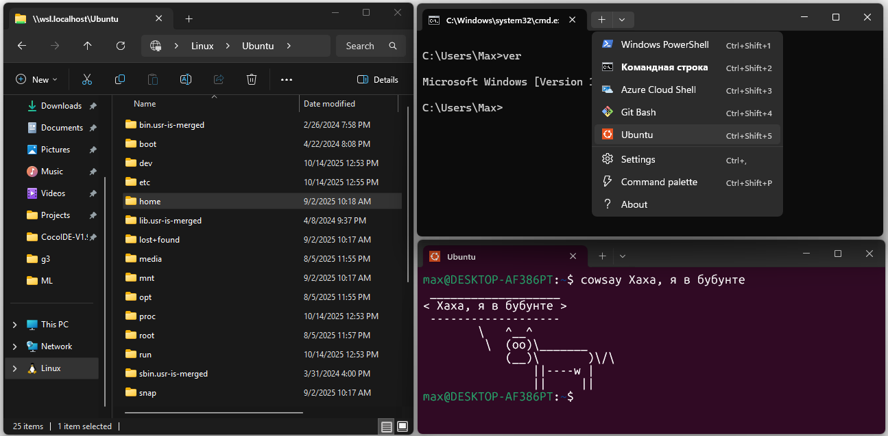
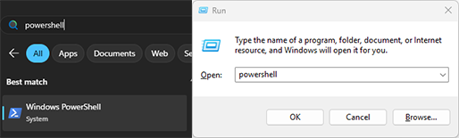
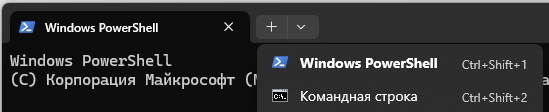
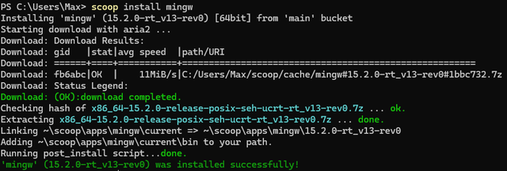
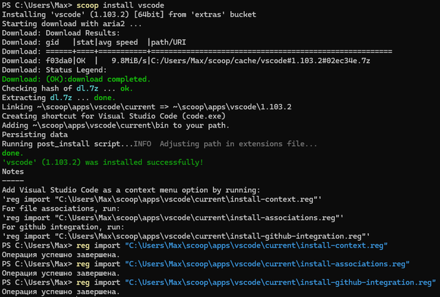
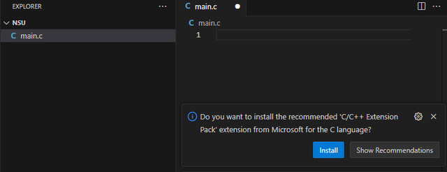
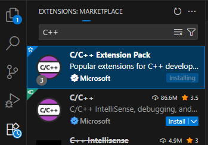
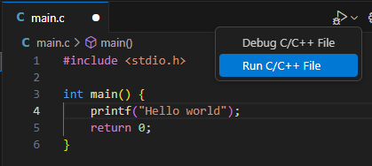
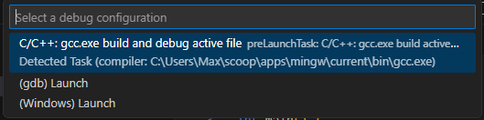

# Установка и подготовка ПК

## Про систему и пути

:::danger АААА буквы
Теперь вы программисты и при работе с системой есть нюансы: немалая часть программистких програм очень плохо воспринимают русские буквы и другие нестадартные символы, в том числе GCC.



Так что важно сделать так чтобы **в пути к вашему коду не было русских буков**, пробелов и прочей гадости. Просто создайте папку с проектами в корне диска, по типу `D:\Projects\` или `C:\NSU\`.

<!-- > А вот у мего друга...

Дада я очень рад что у твоего друга и с русскими буквами всё работает, но я думаю ты не хочешь однажды просидеть 3 дня и понять что дело было просто в пути -->

Также желательно (но уже не так важно) чтобы в пути установки всё было без русского, а учитывая что установка часто в папке пользователя _лучше устанавливать локальную учетную запись и давать простой английский ник_, типо `Admin`, `Viktor` и тд.
:::


Есть три основных стула: *Windows*, *Linux* и *WSL*. Если с первыми двумя более менее понятно, то с последним поподробнее - простым языком, это мини линукс который работает внутри нашей винды. Он в разы легче полноценной виртуальной машины, а также глубоко интерирован: мы можем легко открывать файлы винды через линукс, и наоборот, открывать из винды файлы линукса



Итого:
* Хардкорный вариант это *поставить основной системой Linux*, но надо уметь работать с этой системой и мы лишимся возможности запускать приложения
* Ультимативный вариант *поставить себе WSL*, мы получаем преимущества от двух систем сразу так что имба. Но чтобы пользоваться второй системой знания всё ещё нужны, а **таких задач которые нельзя спокойно решить в винде у нас пока нет**, так что не вижу смысла париться с wsl (если вы уже не разбираетесь)
* И самый *простой вариант - использовать Windows*, а для упрощения работы и установки программ нам очень пригодиться пакетный менеджер

## Пакетный менеджер Scoop


Пакетный менеджер это утилита командной строки, которая позволяет одной коммандой устанавливать, обновлять и удалять различные программы. У разных дистрибутивов Linux есть свои пакетные менеджеры, к примеру `apt` в Ubuntu, и бОльшая часть программ удобно устанавливается буквально одной строчкой без доп действий. В Windows такая практика не принята и надо сначала найти сайт программы, скачать установщик, прокликать установщик и тд. Так ещё и каждая программа устанавливается как и куда хочет

Scoop сильно упрощает установку программ, ведь для этого нужно ввести одну команду, к примеру `scoop install telegram`, и всё, теперь у нас есть телеграм!
Помимо того что он упрощает установку он делает ещё некоторые полезные вещи:
* Программы автоматически и хитрым способом добавляются в `PATH` (Это как раз нам сильно пригодиться с GCC)
* Программы (по возможности) храняться в единой директирии и не разбрасывают свои файлы в `AppData`, `Program Files`, `Program Data` и тд, так что если мы захотим их удалить у нас будет меньше мусора в системе
* Исключает побочные эффекты установки по типу изменение реестра
* Устанавливает зависимости


:::note
Вообще у винды появился встроеный пакетный менеджер WinGet, нооо....
Так то им можно пользоваться, но он примитивнее, из плюсов Scoop он только сам загружает установщик, а устанавливаются они как обычно. Также им сложнее пользоваться, меньше программ, сложнее механизм автообновления и тд, короче оно нам не надо
:::

:::tip Окак
Через Scoop помимо компилятора Си можно установить кучу других полезных программ, к примеру Python, Telegram, VSCode, ShareX, любой браузер, PowerToys и т.д. Найти все доступные программы можно [можно здесь](https://scoop.sh/#/apps)
:::

## 1. Установить Scoop

Для начала нам необходимо открыть PowerShell, это можно сделать через через обычный поиск в системе (`Win+S`) ИЛИ нажимаем `Win+R`, вводим туда `powershell` и запускаем



Убедиться и при необходимоти открыть новое окно можно через плюсик (если у вас одно синие окно без вкладок то всё тоже хорошо)



Вставляем в консоль код ниже. Возможно у нас попросят подтверждение, в таком случае надо напечатать `Y`

```powershell title="powershell"
Set-ExecutionPolicy -ExecutionPolicy RemoteSigned -Scope CurrentUser
Invoke-RestMethod -Uri https://get.scoop.sh | Invoke-Expression
```

После  этого проиходит загрузка и Scoop установлен

<details>
<summary>Можно увеличить скорость загрузки в разы</summary>

При помощи `aria2` можно использовать многопоточное скачивание, тем самым сильно ускорив загрузку, так даже браузеры не могут. Для этого скачиваем `aria2` (после установки scoop автоматически начнет её использовать) и отключаем предупреждение

```bash
scoop install aria2
scoop config aria2-warning-enabled false
```

</details>
## 2. Установить Git

Git это система контроля версий, **он в будущем понадобится каждому**, я вернусь к этому чуть позже, а пока что он нужен Scoop для скачивая пакетов

```bash
scoop install git
```

## 3. Установить GCC

GCC - это компилятор Си (и С++) которым мы будем пользоваться. Но "оригинал" gcc находиться в линуксе, а для Windows есть его порт - MinGW (**Min**imalist **G**NU for **W**indows), его и будем устанавливать:

```
scoop install mingw
```



Невероятно, но на этом всё... Можно перезапустить терминал и команда gcc будет работать, scoop сразу всё добавит в `PATH`.

## 4. Установить VSCode (если ещё не стоит)

VSCode - это текстовый редактор и среда разработки которым мы будем пользоваться. Можете скачать его с сайта, а можно не париться и сделать всё двумя командами:

```bash
scoop bucket add extras
scoop install vscode
```



В конце будут Notes с предложением добавить файлы рееста, если хотим контекстное меню `Открыть с помощью VScode` (рекомендую), то вставляем эти команды в терминал, как это выглядит показал на скриншоте выше.

## 5. Настроить VScode

:::warning Если у вас уже был VScode
Если вы не устанавливали его на предыдущем этапе и он у вас был запущен, то обязательно не забудьте перезагрузить его, чтобы он осознал новые комманды
:::

Открываем VScode (через пуск или code в терминале), выбираем укромную папку и создаем файл с окончанием на `.c` (`main.c`, `test.c`, `task25.c`). Не надо создавать файлы типо `3.с`, следуйте правилам именования переменных.




После создания файла будет предложено установить пак расширений, нажимаем установить и ждём. Если по какой то причине это окошко не появилось, открываем вкладку расширений, вбиваем С++ и устанавливаем сам:




## 6. Запуск кода

1. В нашем файлике пишем базовый код:

```c
#include <stdio.h>

int main() {
  printf("Hello world");
  return 0;
}
```

2. Если вы установили расширения (мб они ещё грузятся, подождите), то справа появится кнопка запуска, нажимаем на стрелочку чтобы открыть меню и выбираем Run:



3. В открывшемся окне тыкаем на дефолтный и самый большой вариант:



4. Внизу выбираем терминал (по умолчанию стоит debug console, это не то)б, и плов готов, наслаждаемся нашей работой:


